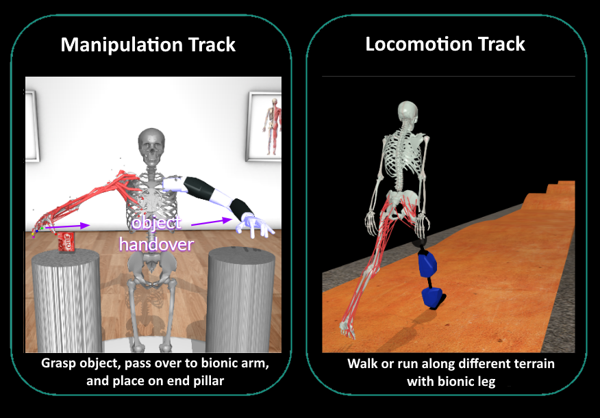

[](https://github.com/MyoHub/myosuite)
[](https://myosuite.slack.com)
[](https://twitter.com/MyoSuite)

# 2024 NeurIPS - MyoChallenge

<p align="center">
  
  <p align="center"><i>MyoChallenge Tasks</i></p>
</p>

Welcome to the [**2024 NeurIPS - MyoChallenge:  Physiological Dexterity and Agility in Bionic Humans**](https://sites.google.com/view/myosuite/myochallenge/myochallenge-2024).

This challenge consists of developing controllers for a physiologically realistic musculoskeletal models to solve dexterous manipulation and locomotion tasks:

- A) **Manipulation task** -- Interact with an object and relocate it (`myoChallengeBimanual-v0`).

- B) **Locomotion task** -- Walk/Run over different terrain with a prosthetic leg (`myoChallengeOslRunRandom-v0`).

[⚠️ Important!] For Phase 2 environment, please upgrade to MyoSuite >= 2.8.0

## Overview
This repository is primarily centered around the submission of your solution, but we also created documentation to help you with:
* Getting started - Take a look at the task [here](./tutorials/run_the_tasks.md) and refer to the [documentation](https://myosuite.readthedocs.io/en/latest/tutorials.html) for more details.
* Run the pre-trained baselines: Look at the examples in this [repo](./tutorials/run_the_baselines.md), refer to the MyoSuite [documentation](https://myosuite.readthedocs.io/en/latest/baselines.html#dep-rl-baseline) for more baselines such as the reflex-controller or take a look at the [deprl](https://deprl.readthedocs.io/en/latest/myo_baselines.html#) docs.
* Train an agent: We provide support for [stable-baselines](https://stable-baselines3.readthedocs.io/en/master/) and for [deprl](https://github.com/martius-lab/depRL) policies. Check out the respective documentation to train an agent.
* Get ready for submission: We offer 2 approaches, [GitHub actions](#github-actions) or [DIY Submission](#diy-submission).


### Github actions 
(detailed description [here](./tutorials/GHaction_Submission.md))
1. [Register an account on Eval-AI](https://evalai.readthedocs.io/en/latest/participate.html) and obtain a `personal token` (on profile page -> "Get your Auth Token")
2. [Clone this template](https://github.com/new?template_name=myoChallenge2024Eval&template_owner=MyoHub) and add the eval-ai `personal token` as "EvalAI_token" (in "Settings" -> "Secrets and variables" -> "Actions" -> "New repository secret")
3. Trigger subission by selecting "Run workflow" in the ["Submission Loco Random" Action](https://github.com/MyoHub/myoChallenge2024Eval/actions/workflows/P2_docker-submission_loco_random.yml)

To customize your solution, please follow the [steps listed below](#step-by-step) below.

### DIY Submission
(detailed description [here](./tutorials/DIY_Submission.md))

This solution requires to setup the project locally and compile docker containers. First install the [prerequisites](./tutorials/DIY_Submission.md/#Prerequisites) and then you can follow the [4 steps listed below](#step-by-step) to upload a solution in EvalAI. In short, the upload of a solution will follow this sequence: 

``` bash
# Step 1 and 2 -- Train your model and personalize the agent evaluation script.
# Those steps can be skipped using the template agents e.g. agent/agent_mani_rotate.py, to test the submission system
## Test that agent agent communicate with environment
sh ./test/test_mani_agent.sh

# Step 3: Build the docker container
docker build -f docker/agent/Dockerfile_Mani . -t myochallengeeval_mani_agent

# Step 4: Upload your policy
evalai push myochallengeeval_mani_agent:latest --phase myochallenge2024-maniphase2-2373 --public

```

#### KNOWN ISSUES


If error to install `grpcio`, a solution is to install it manually

```bash
pip install grpcio==1.47.0
pip install grpcio-tools==1.47.0
```

It might be needed to make the path visible via:
```bash
export PYTHONPATH="./utils/:$PYTHONPATH"
export PYTHONPATH="./agent/:$PYTHONPATH"
```
